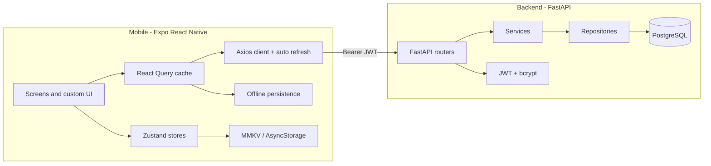

# FitTracker

A production-grade workout tracker: plan workouts, run live training sessions with rest timers, log body weight on a drum-roller dial, track calories and macros, and watch your progress with streaks, charts, and personal records.

Dark-mode only, monochrome white-on-pure-black design. Every component is custom — no default Material widgets.

## Tech stack

**Mobile** — React Native (Expo SDK 56), TypeScript (strict), Expo Router, React Query v5 + Zustand, NativeWind, Reanimated 3/4 + Moti, MMKV (AsyncStorage fallback in Expo Go), @gorhom/bottom-sheet, Zod, Axios with silent token refresh.

**Backend** — FastAPI (Python 3.11), SQLAlchemy 2 ORM, PostgreSQL 16, Alembic, JWT auth (access + refresh) with bcrypt hashing, repository/service layering, standardized `{ data, message, status_code }` envelope.

## Architecture



```
FitTracker/
├── docker-compose.yml     # Postgres 16 + API
├── backend/
│   └── app/
│       ├── main.py        # App factory, CORS, exception handlers
│       ├── core/          # config, security (JWT), database, deps, responses
│       ├── models/        # SQLAlchemy ORM (9 tables)
│       ├── schemas/       # Pydantic v2 request/response models
│       ├── routers/       # auth, users, workout-plans, exercises, sessions, logs, analytics
│       ├── services/      # business logic (auth, analytics)
│       ├── repositories/  # query layer
│       ├── migrations/    # Alembic
│       └── seed.py        # 60+ seeded exercises
└── mobile/
    ├── app/               # Expo Router screens
    │   ├── (auth)/        # login, register, forgot-password
    │   ├── (tabs)/        # dashboard, workouts, log, progress, profile
    │   ├── workout/       # create, [id], session/[id]
    │   ├── onboarding/
    │   ├── weight.tsx
    │   └── calories.tsx
    ├── components/        # ui/, charts/, workout/, weight/, calories/
    ├── hooks/             # React Query hooks per domain
    ├── store/             # Zustand: auth, active session, settings
    ├── services/          # API client + domain services
    ├── lib/               # Zod validation schemas
    └── constants/         # theme.ts, animations.ts
```

## Features

- **Onboarding** — animated logo reveal, 3 swipeable slides, goal + fitness-level selection
- **Auth** — register/login with floating-label inputs, shake-on-error validation, animated password-strength bar, forgot-password flow with animated checkmark, JWT silent refresh on 401
- **Dashboard** — greeting + streak flame badge, today's summary (count-up numbers), horizontal plan scroller, body-weight widget with sparkline, recent activity
- **Workout plans** — bento-grid layout, animated expanding search (300ms debounce), category chips, sorting, create/edit with day-of-week pill scheduler, drag-to-reorder exercises, swipe-to-delete, multi-select exercise picker sheet
- **Live session** — immersive set tracker with large reps/weight inputs, circular animated rest countdown (auto-starts, haptic on finish), exercise queue, animated summary with count-up stats
- **Log** — horizontal calendar strip, entries grouped by day, tap to expand set details, swipe-left delete with red reveal and confirmation
- **Progress** — week/month/3-months/year ranges, calories bar chart, weight line chart, streak ring, daily-goal bar, macro donut, personal records
- **Weight tracker** — drum-roller picker with haptic ticks, optimistic logging, recent logs list
- **Calorie tracker** — animated goal ring, consumed/goal/burned breakdown, four meal sections, food search backed by Open Food Facts (mock fallback offline), macro bar
- **Profile** — stats summary, kg/lbs and km/miles toggles, notifications switch, logout
- Every data screen has skeleton shimmer loading, empty states with CTAs, error states with retry, and pull-to-refresh; offline cache via React Query persistence; optimistic updates with rollback for weight/calorie logs.

## Getting started

### Prerequisites

- Docker Desktop (for PostgreSQL + API), or Python 3.11+ with a local Postgres
- Node 20+, npm
- Expo Go on your phone, or an Android/iOS simulator

### 1. Backend

```bash
cd backend
copy .env.example .env          # adjust SECRET_KEY for production

# Option A: everything in Docker (from repo root)
cd ..
docker compose up -d --build    # API on http://localhost:8000, docs at /docs

# Option B: local Python + Dockerized Postgres
docker compose up -d db
cd backend
python -m venv venv && venv\Scripts\activate
pip install -r requirements.txt
alembic upgrade head            # or rely on startup create_all
uvicorn app.main:app --reload --port 8000
```

Exercises are seeded automatically on first startup (60+ across push/pull/legs/core/cardio/flexibility).

### 2. Mobile

```bash
cd mobile
npm install
npx expo start
```

Scan the QR code with Expo Go. The API base URL is derived automatically from the Expo dev server's LAN IP (port 8000). To override it:

```bash
# mobile/.env
EXPO_PUBLIC_API_URL=http://192.168.1.50:8000
```

> MMKV requires a development build; inside Expo Go the app transparently falls back to AsyncStorage for token persistence.

### Useful commands

```bash
# mobile
npm run typecheck   # strict TS, no any
npm run lint
npm run format

# backend
alembic revision --autogenerate -m "change"
alembic upgrade head
python -m app.seed   # manual reseed
```

## API overview

All routes except `/auth/*` require `Authorization: Bearer <access_token>`. Responses use the envelope `{ data, message, status_code }`.

| Domain | Routes |
| --- | --- |
| Auth | `POST /auth/register`, `/auth/login`, `/auth/refresh`, `/auth/logout` |
| Users | `GET/PUT /users/me`, `PUT /users/me/settings` |
| Plans | `GET/POST /workout-plans`, `GET/PUT/DELETE /workout-plans/{id}` |
| Exercises | `GET/POST /exercises` (search, category, muscle filters) |
| Sessions | `POST/GET /sessions`, `GET/PUT/DELETE /sessions/{id}`, `POST/PUT .../sets` |
| Weight | `GET/POST /weight-logs`, `DELETE /weight-logs/{id}` |
| Calories | `GET/POST /calorie-logs`, `DELETE /calorie-logs/{id}` |
| Analytics | `GET /analytics/summary`, `GET /analytics/progress?range=week\|month\|3months\|year` |

Interactive docs: http://localhost:8000/docs

## Screenshots

| Dashboard | Workouts | Session | Progress |
| --- | --- | --- | --- |
| _coming soon_ | _coming soon_ | _coming soon_ | _coming soon_ |

## Time tracking

| Phase | Time |
| --- | --- |
| Backend (models, auth, routers, analytics, seed, Docker) | ~2.5 h |
| Mobile scaffold + design system + core UI components | ~2 h |
| Screens (onboarding, auth, tabs, session, weight, calories) | ~3 h |
| Polish, type-safety, smoke testing, docs | ~1.5 h |
| **Total** | **~9 h** |
