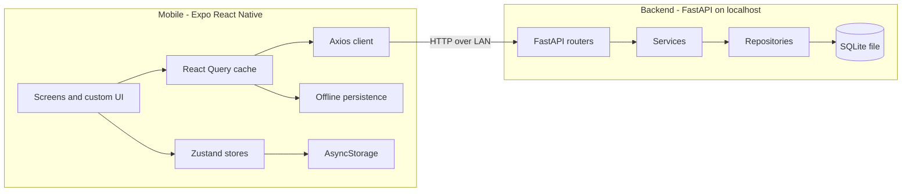

# FitTracker

A production-grade workout tracker: plan workouts, run live training sessions with rest timers, log body weight on a drum-roller dial, track calories and macros, and watch your progress with streaks, charts, and personal records.

Dark-mode only, monochrome white-on-pure-black design. Every component is custom — no default Material widgets.

## Tech stack

**Mobile** — React Native (Expo SDK 54), TypeScript (strict), Expo Router, React Query v5 + Zustand, NativeWind, Reanimated 3/4 + Moti, @gorhom/bottom-sheet, Zod, Axios.

**Backend** — FastAPI, SQLAlchemy 2 ORM, **local SQLite file** (no external database, no Docker), repository/service layering, standardized `{ data, message, status_code }` envelope. Local-first and single-user: **no registration or login** — every request operates as one implicit local user.

## Architecture



```
FitTracker/
├── backend/
│   └── app/
│       ├── main.py        # App factory, CORS, exception handlers
│       ├── core/          # config, database, deps (default user), responses
│       ├── models/        # SQLAlchemy ORM
│       ├── schemas/       # Pydantic v2 request/response models
│       ├── routers/       # users, workout-plans, exercises, sessions, logs, analytics
│       ├── services/      # business logic (analytics)
│       ├── repositories/  # query layer
│       └── seed.py        # default user + 60+ seeded exercises
└── mobile/
    ├── app/               # Expo Router screens
    │   ├── (tabs)/        # dashboard, workouts, log, progress, profile
    │   ├── workout/       # create, [id], session/[id]
    │   ├── weight.tsx
    │   └── calories.tsx
    ├── components/        # ui/, charts/, workout/, weight/, calories/
    ├── hooks/             # React Query hooks per domain
    ├── store/             # Zustand: active session, settings
    ├── services/          # API client + domain services
    ├── lib/               # Zod validation schemas
    └── constants/         # theme.ts, animations.ts
```

## Features

- **No login required** — the app opens straight into the dashboard; all data lives in a local SQLite database on the machine running the backend
- **Dashboard** — greeting + streak flame badge, today's summary (count-up numbers), horizontal plan scroller, body-weight widget with sparkline, recent activity
- **Workout plans** — bento-grid layout, animated expanding search (300ms debounce), category chips, sorting, create/edit with day-of-week pill scheduler, drag-to-reorder exercises, swipe-to-delete, multi-select exercise picker sheet
- **Live session** — immersive set tracker with large reps/weight inputs, circular animated rest countdown (auto-starts, haptic on finish), exercise queue, animated summary with count-up stats
- **Log** — horizontal calendar strip, entries grouped by day, tap to expand set details, swipe-left delete with red reveal and confirmation
- **Progress** — week/month/3-months/year ranges, calories bar chart, weight line chart, streak ring, daily-goal bar, macro donut, personal records
- **Weight tracker** — drum-roller picker with haptic ticks, optimistic logging, recent logs list
- **Calorie tracker** — animated goal ring, consumed/goal/burned breakdown, four meal sections, food search backed by Open Food Facts (mock fallback offline), macro bar
- **Profile** — stats summary, kg/lbs and km/miles toggles, notifications switch (preferences stored locally on the device)
- Every data screen has skeleton shimmer loading, empty states with CTAs, error states with retry, and pull-to-refresh; offline cache via React Query persistence; optimistic updates with rollback for weight/calorie logs.

## Getting started

### Prerequisites

- Python 3.11+ (no database server, no Docker — data is stored in a local SQLite file)
- Node 20+, npm
- Expo Go on your phone (on the same Wi-Fi as your computer), or an Android/iOS simulator

### 1. Backend

```bash
cd backend
python -m venv venv && venv\Scripts\activate
pip install -r requirements.txt

# Bind to 0.0.0.0 so your phone on the same Wi-Fi can reach it
uvicorn app.main:app --host 0.0.0.0 --port 8000
```

On first startup the app creates `backend/fittracker.db`, seeds the single local user, and seeds 60+ exercises (push/pull/legs/core/cardio/flexibility). No `.env` is required; defaults use SQLite.

### 2. Mobile

```bash
cd mobile
npm install
npx expo start
```

Scan the QR code with Expo Go. The API base URL is derived automatically from the Expo dev server's LAN IP (port 8000), so the phone reaches the backend running on your computer. To override it:

```bash
# mobile/.env
EXPO_PUBLIC_API_URL=http://192.168.1.50:8000
```

### Useful commands

```bash
# mobile
npm run typecheck   # strict TS, no any
npm run lint
npm run format

# backend
python -m app.seed   # manual reseed (recreates tables + exercises)
```

## API overview

No authentication — every request operates as the single local user. Responses use the envelope `{ data, message, status_code }`.

| Domain | Routes |
| --- | --- |
| Users | `GET/PUT /users/me`, `PUT /users/me/settings` |
| Plans | `GET/POST /workout-plans`, `GET/PUT/DELETE /workout-plans/{id}` |
| Exercises | `GET/POST /exercises` (search, category, muscle filters) |
| Sessions | `POST/GET /sessions`, `GET/PUT/DELETE /sessions/{id}`, `POST/PUT .../sets` |
| Weight | `GET/POST /weight-logs`, `DELETE /weight-logs/{id}` |
| Calories | `GET/POST /calorie-logs`, `DELETE /calorie-logs/{id}` |
| Analytics | `GET /analytics/summary`, `GET /analytics/progress?range=week\|month\|3months\|year` |

Interactive docs: http://localhost:8000/docs

## Screenshots

| Dashboard | Workouts | Session | Progress |
| --- | --- | --- | --- |
| _coming soon_ | _coming soon_ | _coming soon_ | _coming soon_ |

## Time tracking

| Phase | Time |
| --- | --- |
| Backend (models, routers, analytics, seed) | ~2.5 h |
| Mobile scaffold + design system + core UI components | ~2 h |
| Screens (tabs, session, weight, calories) | ~3 h |
| Polish, type-safety, smoke testing, docs | ~1.5 h |
| **Total** | **~9 h** |
